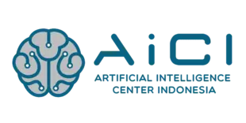

    
    &nbsp;&nbsp;&nbsp;&nbsp;
    

    
    
    
    

## Leanbot — Educational Robotics Platform by AiCI

**leanbot-aici** is a frontend-only web project developed for AiCI to provide structured information, documentation, and educational resources about Leanbot — a STEM robotics platform widely used in competitions, workshops, and learning programs.

---

### About Leanbot

Leanbot is a modular STEM robotics system designed for education, experimentation, and competitive robotics activities. It integrates programmable hardware components, sensors, and expansion modules to support hands-on learning in robotics, engineering, and computational thinking.

AiCI actively utilizes Leanbot in competitions, robotics events, and educational programs organized by the company.

---

### Project Purpose

This repository contains the source code for the official Leanbot informational website developed for AiCI. The website aims to:

- Provide factual and technical information about Leanbot  
- Deliver structured tutorials and usage guides  
- Present documentation and educational resources  
- Serve as a centralized reference platform for Leanbot-related materials  

The website is built as a modern frontend application using Nuxt.

---

### Scope of the Website

The platform includes:

- Leanbot overview and system introduction  
- Hardware and module explanations  
- Usage tutorials and step-by-step guides  
- Educational insights and implementation examples  

---

### Technology Stack

- TypeScript  
- Astro 6.0.4  
- Vue 3.5.30  
- Tailwind CSS 4.2.1  
- Docker  

---

### Repository Structure

This repository contains only the frontend implementation and does not include backend services or proprietary Leanbot firmware.

---

### Ownership & Attribution

This project is developed for AiCI.  
Leanbot and related materials belong to their respective owners.  
This repository serves as an informational and educational platform.

---

### Status

Active development — continuously improved as documentation and educational materials evolve.

---

### Contact

**Artificial Intelligence Center Indonesia (AiCI)**  
Pertamina Multidisciplinary Research Laboratory Building  
Faculty of Mathematics and Natural Sciences  
University of Indonesia, 4th Floor  
Depok, West Java 16424
Phone: 0821-1010-3938

---

### License

Proprietary - All rights reserved by Artificial Intelligence Center Indonesia (AiCI)
